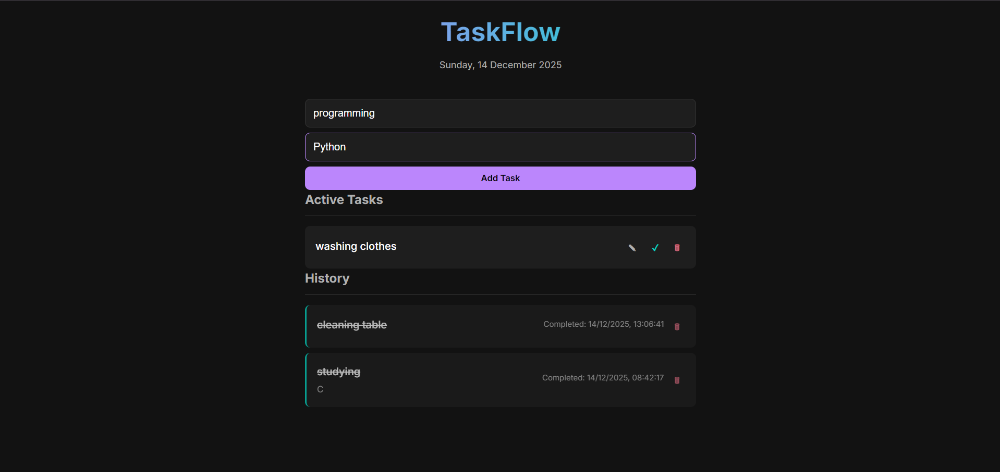

# Simple TO-DO list website
Use `git clone` to download.  
```bash
git clone https://github.com/username/todo-app.git
cd todo-app

### Python example
```md
```python
print("Hello World")
```
[GitHub Repository](https://workspace.google.com/intl/en_in/products/docs/)

---
>this is a note  

| Feature | Status |
|--------|--------|
| Add Task | ✅ |
| Delete Task | ✅ |
| Edit Task | ❌ |
---
